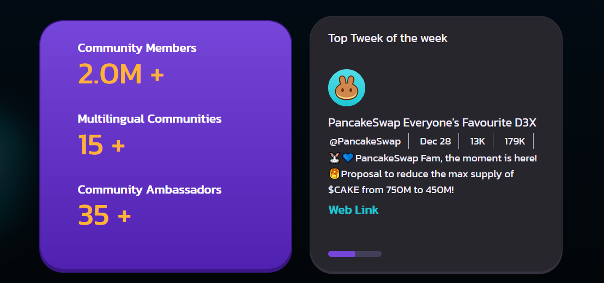

<!-- PROJECT LOGO -->
<br />
<div align="center">
    
  <h2 align="center">PancakeSwap</h2>
</div>

<!-- TABLE OF CONTENTS -->
<details>
  <summary>Contenuti</summary>
  <ol>
    <li>
      <a href="#about-the-project">The Project</a>
         <li><a href="#getting-started">Getting started</a></li>
        <li><a href="#built-with">Built With</a></li>
    </li>
    <li><a href="#contributing">Contributing</a></li>
  </ol>
</details>

<!-- ABOUT THE PROJECT -->

## The Project


<p>Nella parte superiore della pagina si trova la NavBar (Menù), con una serie di menù a discesa che di seguito analizziamo.
</p>
<p> A sinistra, dopo il logo e la scritta di PancakeSwap, sono presenti cinque menù a discesa o dropdown: Trade, Earn, Game, NFT e •••, con le rispettive opzioni. A destra, passando il mouse sull’icona globo è possibile scegliere tra le varie lingue che si aprono in dropdown (anche in fondo alla pagina nel footer). A seguire l’icona delle impostazioni, e BNB Chain  con l’elenco di varie criptovalute. </p>


<p>Passando il mouse sulle card Trade, Earn e Game & NFT, le immagini cambiano di colore e il link si illumina, diventando cliccabile</p>


<p>Nella sezione "Join Our Community" è possibile cliccare sui bottoni delle mini card per scorrere tra le due opzioni</p>

</img>
<p>Cliccando sulle frecce ai lati del carosello contenente le card, queste scorreranno in un verso o in un altro.</p>
</br>
<div display="flex">
 Nella parte inferiore del sito è presente il bottone che cambia il tema da darkmode a light mode e viceversa.</img>
</div>
</br>
<div >
 
<p align="left"> A destra si trova il tasto di scorrimento verso l’alto, che riporta la pagina alla parte superiore. </p> 
</div>
</br>
</br>
</br>
<!-- GETTING STARTED -->

### Getting Started

<h4>Per ottenere una copia locale attiva e funzionante, segui questi semplici passaggi:</h4>

1.Se non l'hai già fatto installa Node.js e Visual Studio Code sul PC;

2. Dal Terminale fai il clone della repository:
   ```sh
   git clone https://github.com/Annagiusi96/pancakeswap
   ```

<!-- BUILT WITH -->

### Built With

- HTML
- CSS
- JavaScript


<!-- CONTRIBUTING -->

## Contributing

Realizzato da :

<ul>
<li><h4><a href="https://github.com/Annagiusi96">The TeamLead Anna Giusi Volpe</a></h4></li>
<li><h4 ><a href="https://github.com/AlexCastels">Alessandro Castelli</a></h4></li>
<li><h4 ><a href="https://github.com/benni90100">Benedetto Miceli</a></h4></li>
<li><h4 ><a href="https://github.com/paluzz34">Chiara Paluzzi</a></h4></li>
<li><h4 ><a href="https://github.com/chiaRapisar">Chiara Rapisardi</a></h4></li>
</ul>

<h6 align="center">Project Link: [https://github.com/Annagiusi96/pancakeswap]</h5>
